 

<table align="center">
  <tr>
    <th align="center">🌐 Web Development</th>
    <th align="center">🛰️ Networking, Infra &amp; Tools</th>
  </tr>
  <tr>
    <td align="center" valign="top">
      
      
      
      
       
      
      
      
      
    </td>
    <td align="center" valign="top">
      
      
      
      
       
      
      
    </td>
  </tr>
</table>

 

